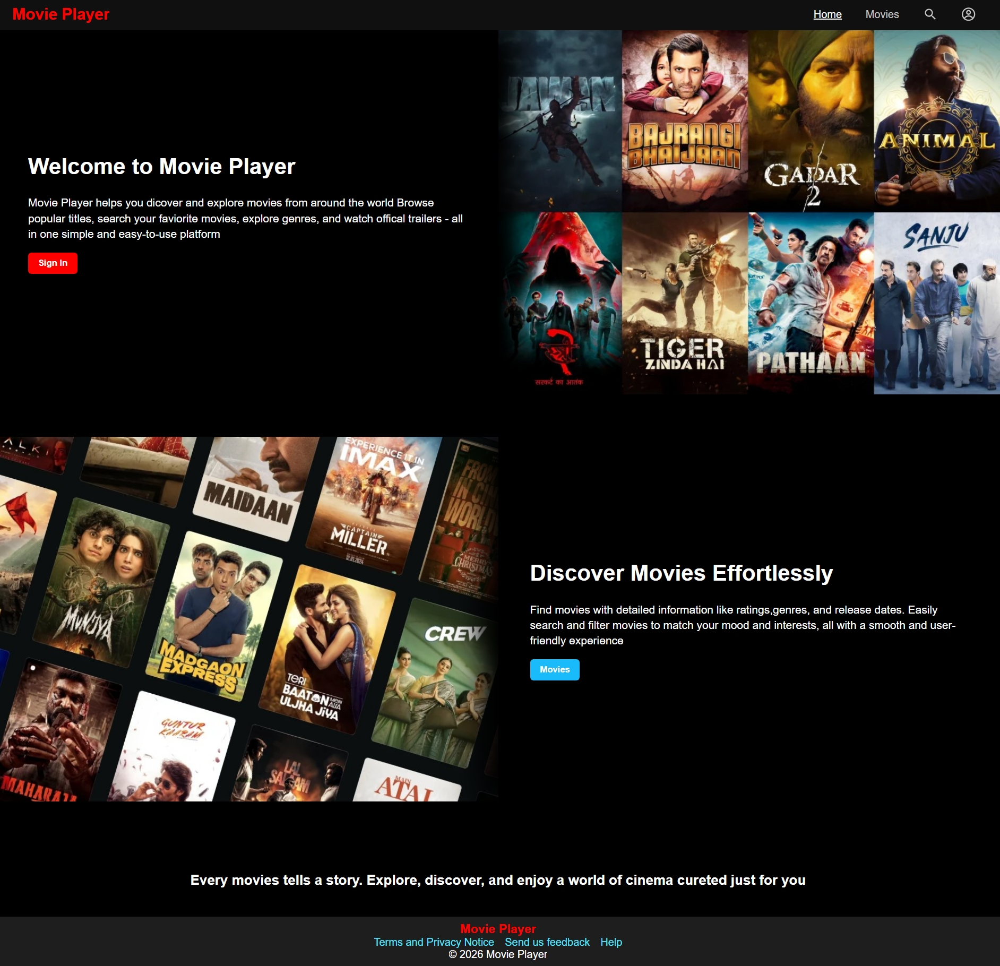
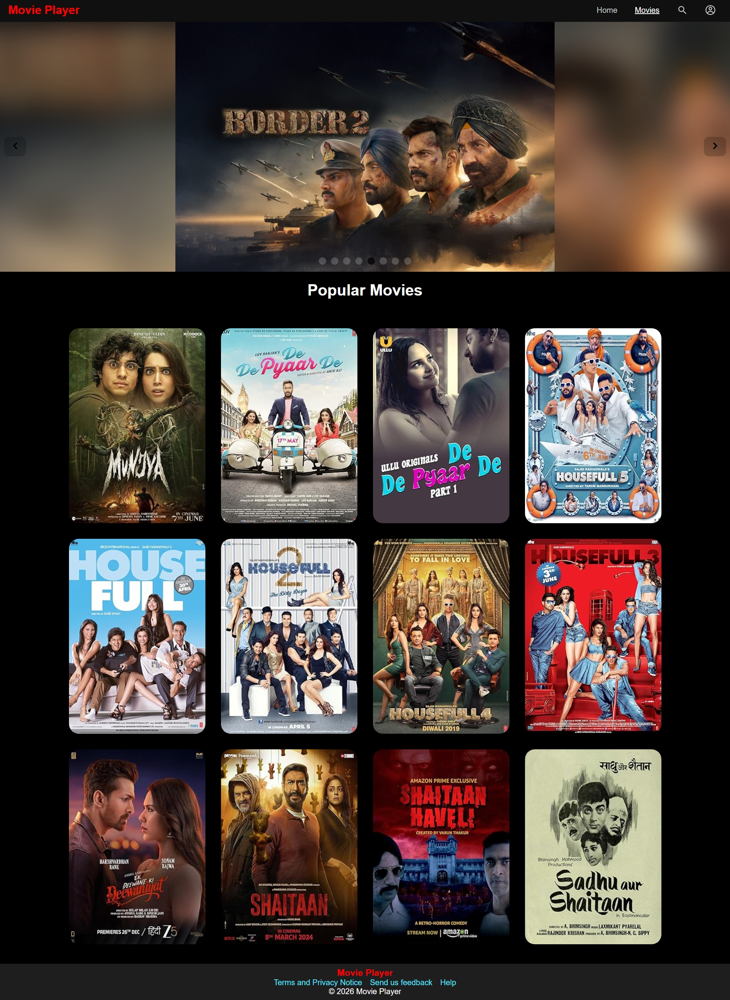
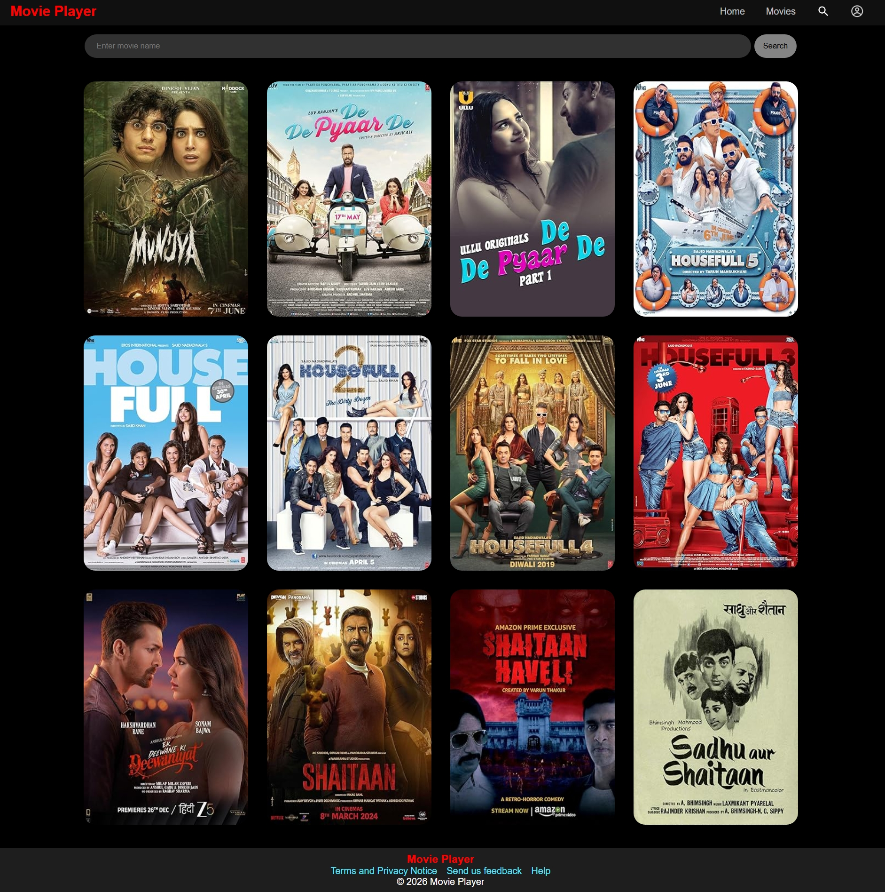
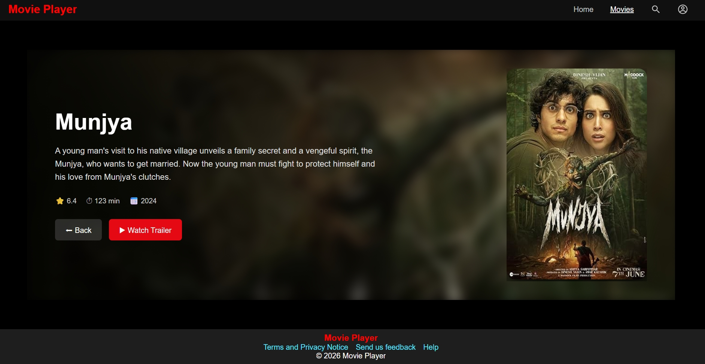
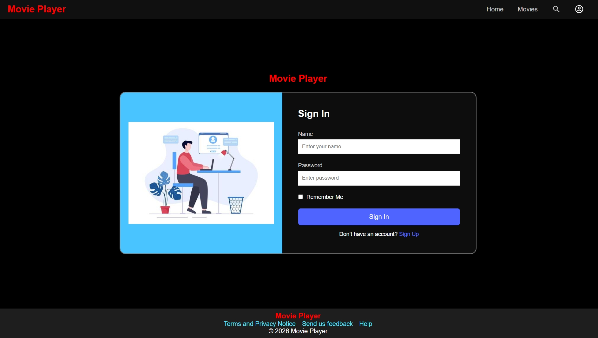
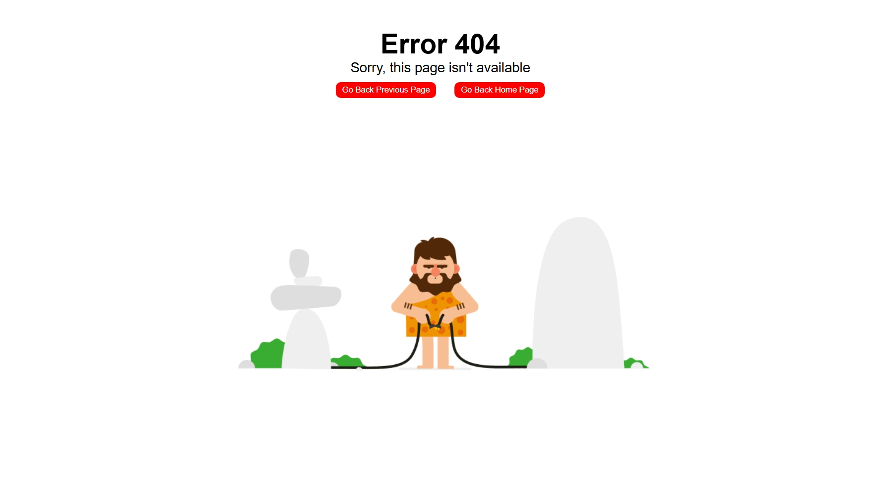

# 🎬 Movie Player

A fully responsive **Movie Player** web application built using **React** and **React Router**.
Users can browse movies, search for their favorite movies, view detailed information, and watch trailers directly.

---

## 🚀 Live Demo

* 🔗 Live Site: https://movieplayerap.netlify.app

* 🔗 GitHub Repository: https://github.com/kajalSaini0017/Movie-Player-App.git

---

## 📷Project Screenshort

| Home Page | Movies Page | Search Page |
|------------|-------------|-------------|
|  |  |  |

| MovieDetails Page | SignIn Page | Error Page |
|-------------------|-------------|------------|
|  |  | 

## ✨ Features

* 🏠 Home Page
* 🎥 Movies Page (API data loads on page render)
* 🔍 Search functionality to find specific movies
* 📄 Dynamic Movie Details Page (using movie ID)
* 🎬 Watch Trailer button (redirects to YouTube)
* 🔙 Back button to return to previous page
* ⚠️ Custom Error Page
* 📱 Fully Responsive Design

---

## 🛠️ Tech Stack

* ⚛️ React
* 🛣️ React Router
* 🎨 CSS (Responsive Styling)
* 🌐 Movie API

---

## ⚙️ Installation & Setup
```bash
git clone https://github.com/kajalSaini0017/Movie-Player-App.git
cd Movie-Player-App
npm install
npm run dev
```


## 🎯 Learning Outcomes

* Implemented dynamic routing using React Router
* Handled API data fetching
* Built reusable components
* Created responsive UI design
* Implemented navigation and error handling